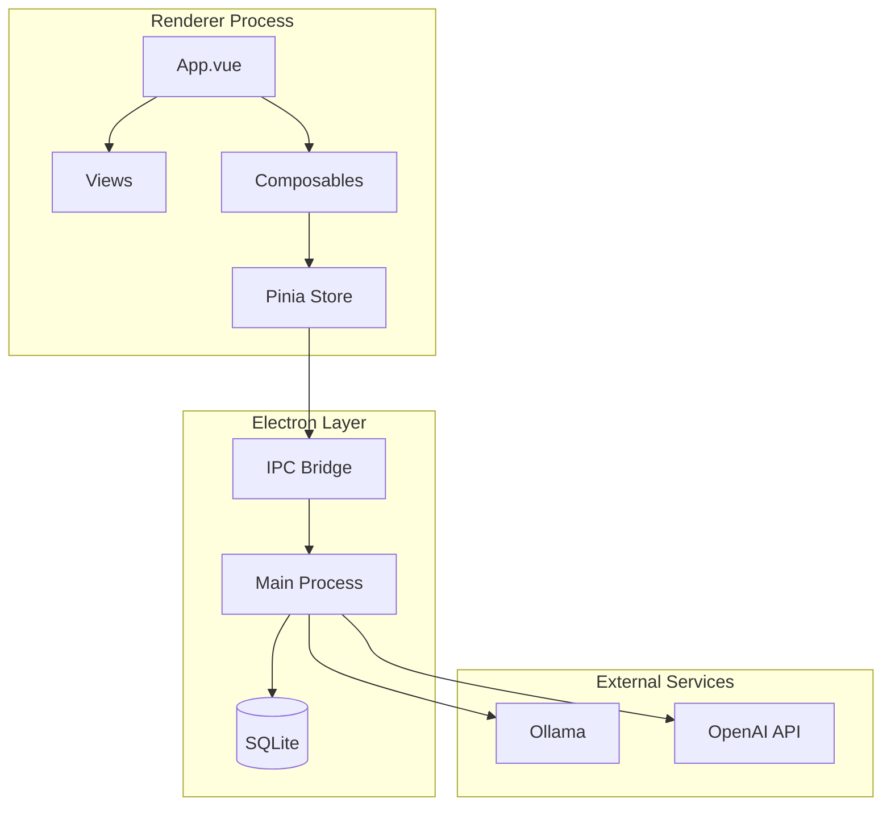
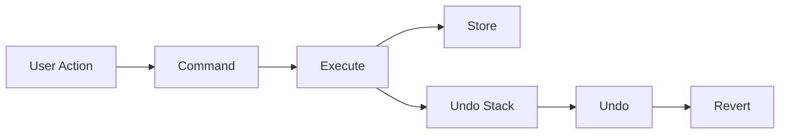
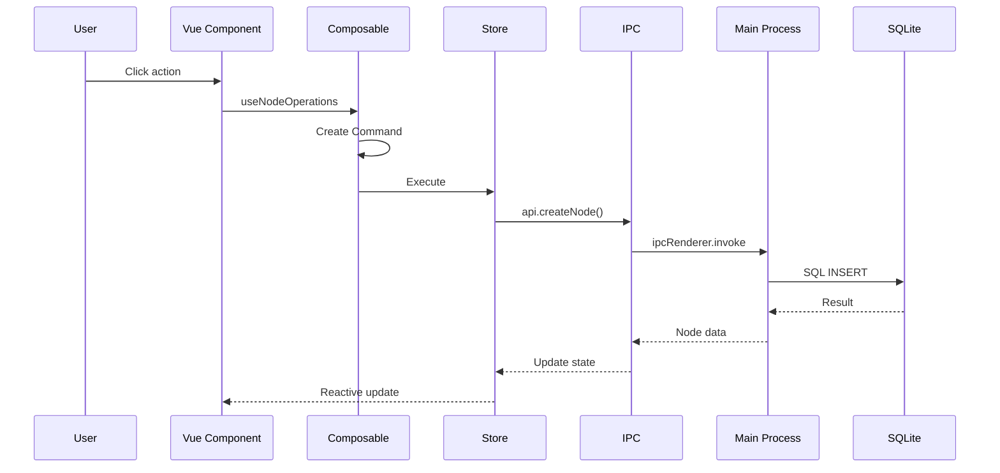

# Architecture Overview

Graph Core is a hierarchical node-based information management system built with Vue 3 and Electron.

## Component Diagram



## Directory Structure

```
src/
├── components/          # Vue components
│   ├── App.vue          # Root component
│   ├── TreeView.vue     # Tree visualization
│   ├── CardsView.vue    # Card layout
│   ├── GraphView.vue    # Force-directed graph
│   ├── TimelineView.vue # Timeline visualization
│   └── ...
├── composables/         # Vue composition functions
│   ├── useNodeOperations.js
│   ├── useUndoRedo.js
│   ├── useSettings.js
│   └── ...
├── stores/              # Pinia stores
│   └── nodes.js         # Node state management
├── commands/            # Command pattern implementations
│   ├── Command.js       # Base command
│   ├── CreateCommand.js
│   ├── EditCommand.js
│   └── ...
├── services/            # API services
│   └── api.js           # Backend communication
├── utils/               # Utility functions
│   ├── constants.js     # Type definitions
│   └── nodeFields.js    # Field configuration
└── main.js              # App entry point

electron/
├── main.js              # Electron main process
└── preload.js           # IPC bridge
```

## Core Concepts

### Node Model

Nodes are the fundamental data unit:

| Field | Type | Description |
|-------|------|-------------|
| id | integer | Primary key |
| title | string | Node name |
| type | string | Node type |
| parent_id | integer | Parent node ID (null for roots) |
| workspace_id | integer | Workspace assignment |
| notes | text | Markdown content |
| position | integer | Sort order within parent |
| status | string | Task status |
| start_date | date | Start date |
| end_date | date | End date |
| due_date | date | Due date |
| tags | json | Tag array |
| color | string | Custom color |
| importance | integer | Priority level (1-5) |

### Command Pattern

All node modifications use the Command pattern for undo/redo:



**Commands:**

- `CreateCommand` - Create new nodes
- `EditCommand` - Modify node fields
- `DeleteCommand` - Remove nodes
- `MoveCommand` - Change parent
- `ReorderCommand` - Change position
- `LinkCommand` - Create/remove links
- `OllamaImproveNotesCommand` - AI text modifications

### Composables

Vue 3 composition functions encapsulate reusable logic:

| Composable | Purpose |
|------------|---------|
| `useNodeOperations` | CRUD operations |
| `useUndoRedo` | Command history |
| `useSettings` | User preferences |
| `useWorkspace` | Workspace management |
| `useNavigation` | Node navigation |
| `useSelection` | Multi-select state |
| `useKeyboardShortcuts` | Global hotkeys |
| `useOllama` | AI integration |
| `useToast` | Notifications |

### State Management

Pinia store (`stores/nodes.js`) manages:

- Node tree structure
- Current selection
- Container (current view root)
- Recent items
- Favorites

### IPC Communication

Electron IPC handles:

- Database operations (CRUD)
- File system access
- AI API calls (Ollama, OpenAI)
- Window management

## Data Flow



## Views Architecture

Each view component receives:

- `nodes` - Filtered node tree
- `containerId` - Current root node
- Events for selection, navigation, context menus

Views emit standardized events:

- `select` - Node selection
- `enter` - Navigate into node
- `context-menu` - Right-click menu
- `update` - Field changes

## See Also

- [Installation](../getting-started/installation.md)
- [Contributing](../contributing/development.md)
