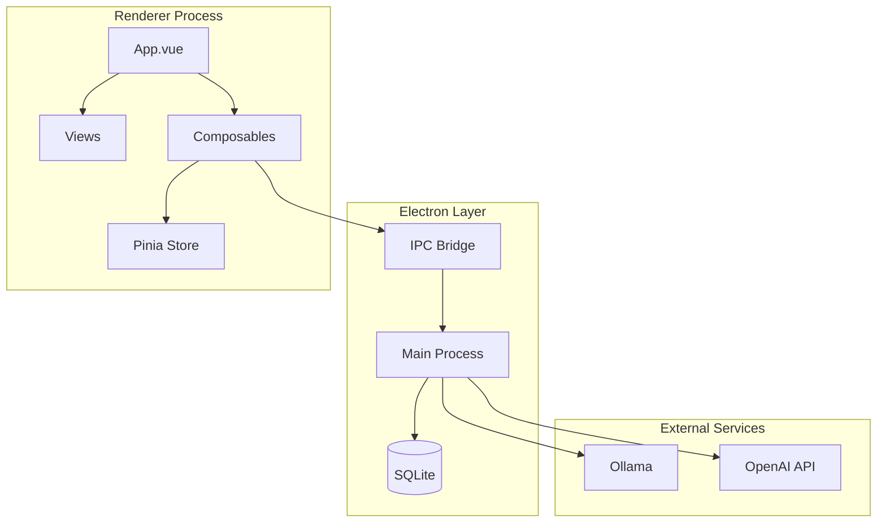
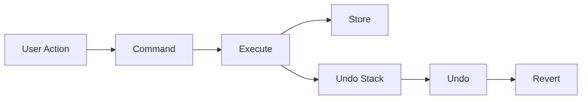
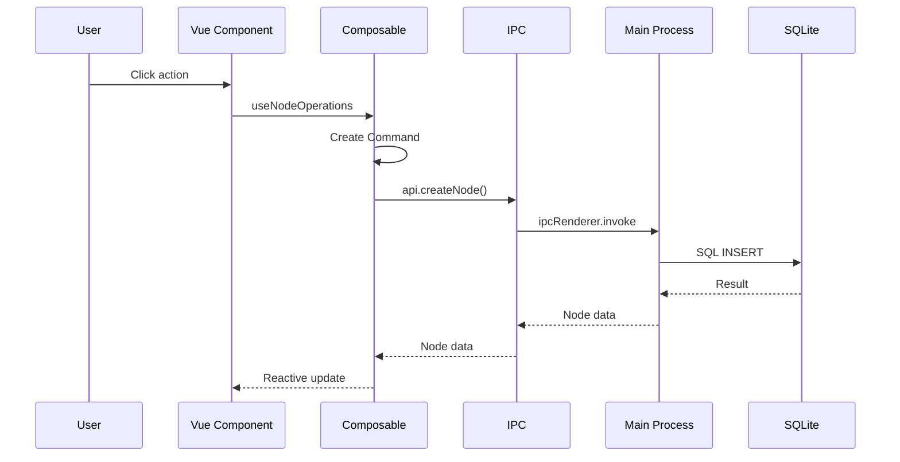

# Architecture Overview

Graph Core is a hierarchical node-based information management system built with Vue 3 and Electron.

## Component Diagram



## Directory Structure

```
src/
├── components/          # Vue components
│   ├── App.vue          # Root component
│   ├── TreeView.vue     # Tree visualization
│   ├── CardsView.vue    # Card layout
│   ├── GraphView.vue    # Force-directed graph
│   ├── TimelineView.vue # Timeline visualization
│   └── ...
├── composables/         # Vue composition functions
│   ├── useNodeOperations.ts
│   ├── useUndoRedo.ts
│   ├── useSettings.ts
│   └── ...
├── stores/              # Pinia stores
│   └── filters.js       # Shared view filter state
├── commands/            # Command pattern implementations
│   ├── Command.js       # Base command
│   ├── CreateCommand.js
│   ├── EditCommand.js
│   └── ...
├── services/            # API services
│   ├── api.ts           # Backend communication (IPC / REST)
│   └── nodeCache.js     # LRU cache with TTL
├── utils/               # Utility functions
│   ├── constants.js     # Type definitions
│   └── nodeFields.js    # Field configuration
└── main.js              # App entry point

electron/
├── main.js              # Electron main process
├── ipcChannels.js       # Channel name constants (shared by main and preload)
└── preload.js           # IPC bridge (bundled to preload.build.js before launch)
```

## Core Concepts

### Node Model

Nodes are the fundamental data unit:

| Field | Type | Description |
|-------|------|-------------|
| id | integer | Primary key |
| title | string | Node name |
| type | string | Node type |
| parent_id | integer | Parent node ID (null for roots) |
| workspace_id | string | Workspace slug (e.g. `work`), not a number |
| path | string | Slash-joined ancestor ids (`''` for roots) |
| depth | integer | Number of ancestors |
| notes | text | Markdown content |
| sort_order | integer | Position within parent |
| completed | boolean | Completion flag |
| start_date | date | Start date |
| end_date | date | End date |
| due_date | date | Due date |
| tags | json | Tag array |
| color | string | Custom color |
| importance | integer | Priority level (1-5) |

### Command Pattern

All node modifications use the Command pattern for undo/redo:



**Commands:**

- `CreateCommand` - Create new nodes
- `EditCommand` - Modify node fields
- `DeleteCommand` - Remove nodes
- `MoveCommand` - Change parent
- `ReorderCommand` - Change position
- `LinkCommand` - Create/remove links
- `OllamaImproveNotesCommand` - AI text modifications

### Composables

Vue 3 composition functions encapsulate reusable logic:

| Composable | Purpose |
|------------|---------|
| `useNodeOperations` | CRUD operations |
| `useUndoRedo` | Command history |
| `useSettings` | User preferences |
| `useWorkspace` | Workspace management |
| `useNavigation` | Node navigation |
| `useSelection` | Multi-select state |
| `useKeyboardShortcuts` | Global hotkeys |
| `useOllama` | AI integration |
| `useToast` | Notifications |
| `useErrorHandler` | Centralized error handling with toast notifications |

### Services

| Service | Purpose |
|---------|---------|
| `api.ts` | Backend communication (IPC in Electron, REST in the browser) |
| `nodeCache.js` | LRU cache with TTL for node data |
| `ollamaService.js` / `openaiService.js` | AI provider clients |
| `agentService.js` / `wikipediaService.js` | Research agent and its Wikipedia tool |

### State Management

Node data is not held in a global store: components load it through `services/api.ts` and the composables above. The single Pinia store, `stores/filters.js`, holds the filter state shared across views (visible node types, max depth) and is synced from the current container's settings.

### IPC Communication

Electron IPC handles:

- Database operations (CRUD)
- File system access
- AI API calls (Ollama, OpenAI)
- Window management

Channel names are defined once in `electron/ipcChannels.js` and imported by both
the main process and the preload script, so a rename cannot silently drift.

The window runs with `sandbox: true`. A sandboxed preload's `require` only
resolves a fixed whitelist (electron, events, timers, url) and cannot load
relative modules, so `electron/preload.js` is bundled into `preload.build.js`
(via `npm run bundle:preload`, run by every dev and packaging script and by the
release workflow before `electron-builder`). This inlines `ipcChannels.js`
while keeping the OS sandbox enabled.

`preload.build.js` is a gitignored build artifact, so a packaging path that
skips the bundling step ships an app without a preload: `window.electronAPI`
is undefined, the renderer silently falls back to the web HTTP API, and every
data call fails. The release workflow therefore verifies each packaged
`app.asar` contains `electron/preload.build.js` before uploading artifacts;
a build without it fails the release.

## Data Flow



## Views Architecture

Each view component receives:

- `nodes` - Filtered node tree
- `containerId` - Current root node
- Events for selection, navigation, context menus

Views emit standardized events:

- `select` - Node selection
- `enter` - Navigate into node
- `context-menu` - Right-click menu
- `update` - Field changes

## See Also

- [Installation](../getting-started/installation.md)
- [Contributing](../contributing/development.md)
